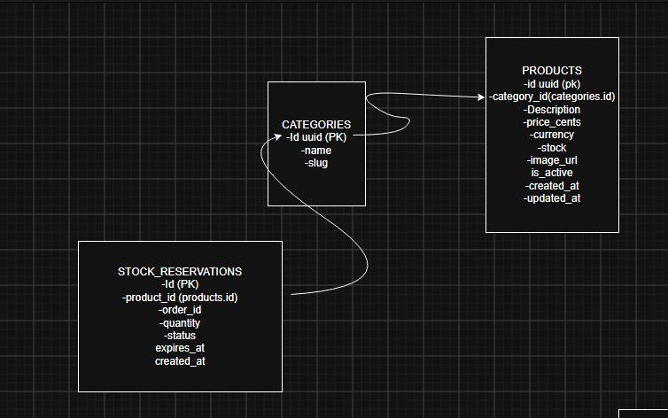
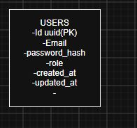
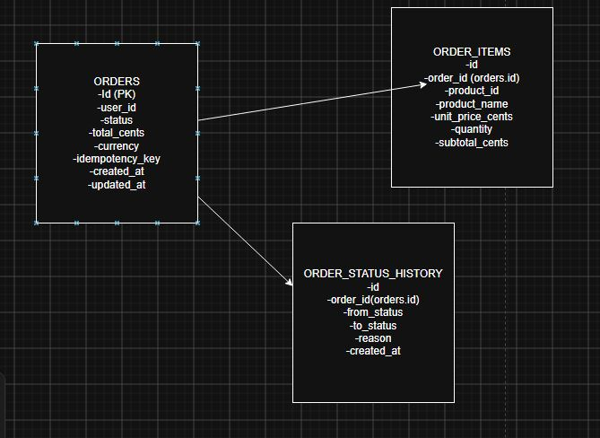
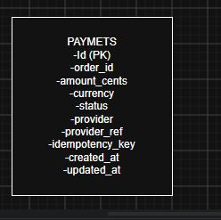

## Modelo de datos

El modelo está separado por microservicio. Cada servicio tiene su propia base de datos,
y las relaciones entre servicios son **referencias lógicas** (por ID), no *foreign keys* físicas.
Esto permite que cada servicio evolucione su esquema de forma independiente.

### Servicio de Products

Gestiona el catálogo, las categorías y las reservas de stock.

### Servicio de Users

Gestiona usuarios, autenticación y roles.

### Servicio de Orders

Gestiona las órdenes, sus ítems y el historial de estados.

### Servicio de Payments

Gestiona los pagos asociados a cada orden, con soporte para idempotencia.

